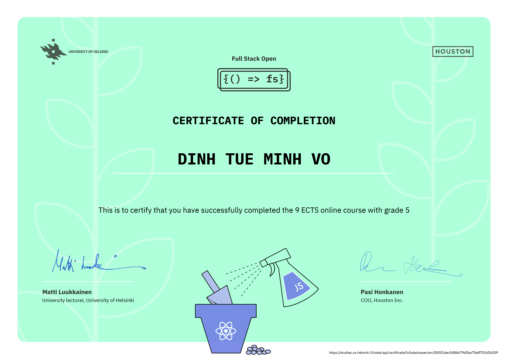

# FULLSTACK OPEN 2020
_The solutions may or may not be correct_   

## Table of Contents
- [Overview](#Overview)
- [Showcase](#Showcase)
- [Notes](#Notes)
- [Acknowledgement](#Acknowledgement)
- [Certificate](#Certificate)

## Overview
This repository contains **my solutions** to the first topic of the [Full Stack Open 2020 Course][full-stack-open-2020]. This topic mainly focuses on building single page applications with React.JS that use REST APIs and Node.JS. Testing, TypeScript and GraphQL are also introduced in this part.   
 

My solution to the second topic of this course, [React Native][part-10-course-link], can be found [here][react-native-solution-github].

## Showcase
- [**Patientor**][patientor-app] 
  - Demo: https://patientor-ts.herokuapp.com  
  - Code: https://github.com/minhvo-dev/MOOC.fi-Full-Stack-Open-2020/tree/dev/part_09/patientor

## Notes
_Some key concepts of each part_

### Part 0 - Fundamentals of Web apps
_Introducing basic concepts of web application_

### Part 1 - Introduction to React
_Introducing JavaScript and React concepts_    
- [Stateful component][stateful-component-topic-link]
  - Add state to a React component with React's [state hook][react-state-hook-link]  
  - **Never mutate state directly**
- [Event handling][event-handling-topic-link]
  - Understand the difference between a **function call** and a **function** (or a **function reference**)   
- [Rules of Hooks][rules-of-hooks-topic-link]   
  - "Hooks may only be called from the inside of a function body that defines a React component, not from inside of a loop, a conditional expression, or any place that is not a function that defining a component".   

### Part 2 - Communicating with server
_Handling form input and communicating with backend_
- [Rendering a collection][rendering-collection-topic-link]
  - Use [`Array.prototype.map`][array.prototype.map-link] to render a collection
  - **Issues of using array indexes as keys**
- [axios and promises][axios-and-promises-topic-link]  
  - Promise chain with `.then` and `.catch`
- [Effect-hooks][effect-hooks-topic-link]
  - Use [effect hooks][hook-effect-react] to perform side effects in function components such as data fetching, setting up a subscription, etc.

### Part 3 - Programming a server with NodeJS and Express
_Implementing backend with REST API using Node.js and Express_  
- Use `json-parser` middleware to easily access the data in HTTP POST request 
- Use `.get` method or `headers` property of the `request` object to find out the headers of the HTTP request.
- [Middleware][middleware-topic-link]   
  - Can be used to create a custom logger
  - Can be used to allow requests from other _origins_ by using [`cors`][cors-middleware-link] middleware.
- [Mongoose][mongoose-webpage]   
  - Connect backend to MongoDB
  - Validate data

### Part 4 - Testing Express servers, user administration
_Writing unit tests and integration test with Jest; and implementing token based authentication in backend_
- Use `Express.router()` middleware to define **related routes** in a single module.
- **Unit testing**: tests only individual section of the app to ensure it meet its design and behave as indended.   
- **Integration testing**: tests multiple components of the app at once.
- `async/await`
  - to execute _asynchronous functions_ in a way that looks _synchronous_.
- Use `try/catch` and `next` to handle errors 
- [References across collections][reference-across-collections-topic-link] in document databases   
  - `.populate()` method in mongoose can be used to **join** data.
- [JSON Web Tokens][json-web-token-topic-link]

### Part 5 - Testing React apps
_Implementing frontend login; and testing React apps with Jest, React Testing Library and Cypress_
- Use the browser's local storage to save the token.
- Use `props.children` for referencing the child components of the current component.
  - `children` is automatically added by React and always exists.
- [Reference to components with `ref`][references-to-components-with-ref-topic-link]
- [End to end testing with Cypress][end-to-end-testing-topic-link]

### Part 6 - State management with Redux
_Introducing Flux architecture and Redux_
- [Flux][flux-documentation-webpage]   
  - Separate state from React components into its own `store`s
  - Manipulate state with `action`s, as a result the views are re-rendered.   
  - Actions are `dispatch`ed to the store.
- [Redux][redux-webpage]  
  - Follows flux-architecture but a bit more simple.
  - How `action`s affect `store`s is defined in `reducer`s. 
  - Reducers are used to create stores, and never supposed to be called directly from the application code.
  - Reducers must be **pure functions**, which _do not cause any side effects_ and _always return the same response when called with the same parameters_.   
- [Action creators/factory][action-creators-topic-link]  
  - Separate the creation of actions in its own modules.
- [`react-redux`][react-redux-topic-link]
  - Easiest way to forward Redux-store to various components
- Complex state
  - Specific part of the state can be extracted by using `useSelector` from `react-redux`
  - Reducers can be combined by using `combineReducers` from `redux`  
- Asynchronous actions and `redux-thunk`
  - Middleware `redux-thunk` can be used to apply asynchronous actions to the store.
- [Another way to use redux - `connect`][connect-topic-link]

### Part 7 - React router, custom hooks, styling app with CSS and webpack
_Navigating, styling React applications, utilizing custom hooks, and introducing Webpack_
- Navigation in SPA is different than traditional webpage.  
  - Use `react-router-dom` to enable routing.
  - Use `useHistory` (a **hook-function**) to create a history object in order to modify the browser's url programmatically.
- Custom hooks
  - Extract component logic into reuseable functions.
  - Are regular JS functions that use any other hooks.
  - Must adhere to the **rules of hooks**.
  - The name must start with the word **use**.
- Bundling with webpack
  - Bundle all of the source code files into a single file.
  - By default, webpack only knows how to deal with plain JS.
  - `babel-loader` can be used to **transpile** JSX files to JS files before they are bundled. `@babel/polyfill` could be used to bundle `async/await` functions.   
  - `css-loader`, `style-loader` can be used to load and bundle CSS files
- Minifying the code
  - Optimize the file size by removing unused code and comments.   
- [Class components][class-component-topic-link]

### Part 8 - GraphQL
_Introducing GraphQL with Apollo Server and Apollo Client_   
- The main principle of GraphQL
  - A query describing the required data from client is sent to an API with an HTTP POST request.
  - The API has only one address, and accepts all queries.   
  - A **Schema** describes the data sent between the client and the server.   
  - A **Query** describes what kinds of queries available, what kind of parameters the queries require, and what kind of data the queries return.
  - **Mutation**s allow one to modify server-side data.
  - **Fragment**s create reusable code/units in GraphQL.  
  - **Subscription** creates two way communication between clients and servers. 
- Caching in Apollo client
  - By default, Apollo Client stores the results of its GraphQL queries in a normalized, in-memory [cache][cache-apollo-doc].   
  - To update the cache:   
    - [Polling][polling-apollo-doc]: 
      - Pros: easy to implement 
      - Cons: pointless web traffic most of the time.
    - Run [`refetchQueries`][refetchQueries-apollo-doc] hook after a mutation
      - Pros: only update when needed
      - Cons: 
        - Not easy to implement
        - Only update the cache after performing a mutation
    - Manually update the cache with `update` callback  
- [Subscriptions][subscription-apollo-doc]
  - WebSockets is used rather than HTTP protocol
  - **n + 1 problem**     
    - [Dataloader][dataloader-webpage] library offers a good solution.

### Part 9 - TypeScript
_Introducing TypeScript_
- TypeScript is a typed superset of JavaScript, and eventually it's compiled into plain JavaScript code. 
- TypeScript offers:   
  - Type checking and static code analysis.
  - Code level documentation
  - Intellisense assistance
- `@types/{npm_package}` could be used to find the typed version of the package
- [Utility Types][utility-types-doc]
- [`interface` vs `type`][interface-vs-type-doc]
  - Are interchangeable in most case.
  - Multiple interfaces with the same name will be merged.
  - Multiple types with the same name will cause error.

## Acknowledgement
- Special thanks to:  
  - [The University of Helsinki][helsinki-uni-link] for providing the certificate.
  - [Matti Luukkainen][matti-github-link] and others for preparing and improving the content of this awesome course.

## Certificate

[full-stack-open-2020]: https://fullstackopen.com/en/ "Full Stack 2020 Course link"
[react-native-solution-github]: https://github.com/minhvo-dev/MOOC.fi-React-Native-2020
[part-10-course-link]: https://fullstackopen.com/en/part10
[react-state-hook-link]: https://reactjs.org/docs/hooks-state.html   
[stateful-component-topic-link]: https://fullstackopen.com/en/part1/component_state_event_handlers#stateful-component    
[event-handling-topic-link]: https://fullstackopen.com/en/part1/component_state_event_handlers#event-handling   
[passing-state-topic-link]: https://fullstackopen.com/en/part1/component_state_event_handlers#passing-state-to-child-components   
[rules-of-hooks-topic-link]: https://fullstackopen.com/en/part1/a_more_complex_state_debugging_react_apps#rules-of-hooks   
[array.prototype.map-link]: https://developer.mozilla.org/en-US/docs/Web/JavaScript/Reference/Global_Objects/Array/map   
[rendering-collection-topic-link]: https://fullstackopen.com/en/part2/rendering_a_collection_modules#rendering-collections   
[axios-and-promises-topic-link]: https://fullstackopen.com/en/part2/getting_data_from_server#axios-and-promises
[effect-hooks-topic-link]: https://fullstackopen.com/en/part2/getting_data_from_server#effect-hooks   
[hook-effect-react]: https://reactjs.org/docs/hooks-effect.html   
[middleware-topic-link]: https://fullstackopen.com/en/part3/node_js_and_express#middleware   
[cors-middleware-link]: https://github.com/expressjs/cors   
[mongoose-webpage]: https://mongoosejs.com/index.html   
[reference-across-collections-topic-link]: https://fullstackopen.com/en/part4/user_administration#references-across-collections   
[json-web-token-topic-link]: https://fullstackopen.com/en/part4/token_authentication   
[references-to-components-with-ref-topic-link]: https://fullstackopen.com/en/part5/props_children_and_proptypes#references-to-components-with-ref   
[end-to-end-testing-topic-link]: https://fullstackopen.com/en/part5/end_to_end_testing   
[flux-documentation-webpage]: https://facebook.github.io/flux/docs/in-depth-overview/    
[redux-webpage]: https://redux.js.org/   
[action-creators-topic-link]: https://fullstackopen.com/en/part6/flux_architecture_and_redux#action-creators   
[react-redux-topic-link]: https://fullstackopen.com/en/part6/flux_architecture_and_redux#forwarding-redux-store-to-various-components   
[connect-topic-link]: https://fullstackopen.com/en/part6/connect   
[class-component-topic-link]: https://fullstackopen.com/en/part7/class_components_miscellaneous#class-components    
[cache-apollo-doc]: https://www.apollographql.com/docs/react/caching/cache-configuration/    
[polling-apollo-doc]: https://www.apollographql.com/docs/react/data/queries/#polling   
[refetchQueries-apollo-doc]: https://www.apollographql.com/docs/react/caching/advanced-topics/#rerunning-queries-after-a-mutation    
[subscription-apollo-doc]: https://www.apollographql.com/docs/react/data/subscriptions/   
[dataloader-webpage]: https://github.com/graphql/dataloader    
[utility-types-doc]: https://www.typescriptlang.org/docs/handbook/utility-types.html   
[interface-vs-type-doc]: https://www.typescriptlang.org/docs/handbook/advanced-types.html#interfaces-vs-type-aliases

[helsinki-uni-link]: https://www.helsinki.fi/fi "The University of Helsinki website"
[matti-github-link]: https://github.com/mluukkai   

[patientor-app]: https://patientor-ts.herokuapp.com